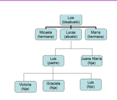
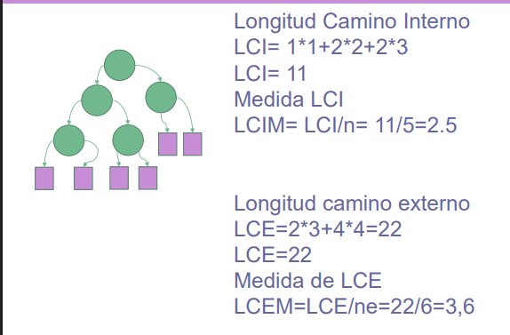

:PROPERTIES:
:ID:       1a0b9abf-c608-441c-be1d-452e1b6105cf
:END:
#+options: ':nil *:t -:t ::t <:t H:3 \n:nil ^:t arch:headline
#+options: author:t broken-links:nil c:nil creator:nil
#+options: d:(not "LOGBOOK") date:t e:t email:nil f:t inline:t num:t
#+options: p:nil pri:nil prop:nil stat:t tags:t tasks:t tex:t
#+options: timestamp:t title:t toc:t todo:t |:t
#+title: Arboles Introducción
#+date: 2026-07-15 Wed
#+filetags: :clases:eda:arboles:
#+author: Santiago Javier Proaño Yépez
#+email: santiagoproano06@gmail.com
#+language: en
#+select_tags: export
#+exclude_tags: noexport
#+creator: Emacs 29.3 (Org mode 9.6.15)
#+cite_export:
* Arboles
Los arboles son una colección jerárquica de nodos.
#+ATTR_LATEX: :float nil :width 0.8\textwidth
#+CAPTION: Ejemplo de árbol
#+NAME: fig:arbolEjemplo

** Características
- Nodo raíz
  Este es el nodo principal de la estructura, es de donde salen todas
  las ramas.
- Nodos hermanos
  Igual nivel de jerarquía.
- Nodos interiores
  Entre los nodos raíz y los nodos hojas.
- Nodo hoja
  Los últimos nodos.
- Grado
  Numero de enlaces de un nodo.
- Grado del árbol
  El mayor grado de todos los nodos.
- Nivel de árbol
  Los niveles que tiene el árbol😒
- Camino
  Secuencia de nodos hasta un nodo en especifico.
*** Longitudes
Es el numero de arcos que se deben recorrer hasta llegar a un nodo x
****  Longitud de camino interno
  Suma de toditos los caminos del árbol.
  #+begin_export latex
\[
LCI = \sum_{i=1}^{h} n_i \times i
\]
#+end_export
Donde $ni$ es el numero de nodo es en el nivel i. Y $h$ es la altura
  del árbol.
  Aparte de esta formula tenemos la longitud de camino interno media:
#+begin_export latex
\[
LCIM = \frac{LCI}{n}
\]
#+end_export
Donde $n$ es el número de nodos del árbol.
**** Longitud de camino externo
Para esto hay que entender dos conceptos:
- Árbol extendido: el numero de hijos por nodo es igual al grado del
  árbol.
- Nodos especiales: nodos representados con cuadrados que se agregan
  si un nodo no cumple con dicha condición del árbol extendido.
La LCE se calcula con:
#+begin_export latex
\[
LCE = \sum_{i=2}^{h+1} n_ei \times i
\]
#+end_export
Donde $n_{ei}$ es el numero de nodos especiales en dicho nivel.

A si mismo tenemos la LCE media:
#+begin_export latex
\[
LCEM = \frac{LCE}{ne}
\]
#+end_export
#+ATTR_LATEX: :float nil :width 0.8\textwidth
#+CAPTION: Ejemplo de calculo de LC
#+NAME: fig:calculoLC

Seguimos con [[id:c593e08c-da6c-412e-ab97-5b868f39fb5a][Arboles Binarios]]
