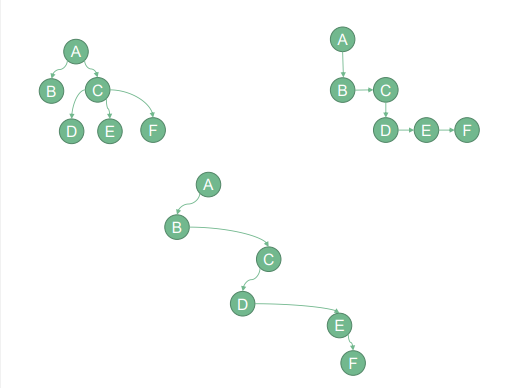
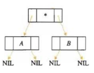
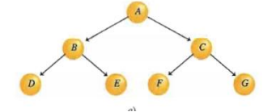

:PROPERTIES:
:ID:       c593e08c-da6c-412e-ab97-5b868f39fb5a
:END:
#+options: ':nil *:t -:t ::t <:t H:3 \n:nil ^:t arch:headline
#+options: author:t broken-links:nil c:nil creator:nil
#+options: d:(not "LOGBOOK") date:t e:t email:nil f:t inline:t num:t
#+options: p:nil pri:nil prop:nil stat:t tags:t tasks:t tex:t
#+options: timestamp:t title:t toc:t todo:t |:t
#+title: Arboles Binarios
#+date: 2026-07-15 Wed
#+filetags: :clases:eda:aboles:
#+author: Santiago Javier Proaño Yépez
#+email: santiagoproano06@gmail.com
#+language: en
#+select_tags: export
#+exclude_tags: noexport
#+creator: Emacs 29.3 (Org mode 9.6.15)
#+cite_export:
* Binarios
Como su nombre lo indica son arboles de grado 2, es decir cada nodo
puede estar conectado hasta máximo 2 nodos más.
** Pasar de árbol a árbol binario
Desde [[id:1a0b9abf-c608-441c-be1d-452e1b6105cf][Arboles Introducción]]. A  todo el nivel se lo enlaza de forma horizontal y a los hijos de
forma vertical.
#+ATTR_LATEX: :float nil :width 0.8\textwidth
#+CAPTION: Transformación de árbol a árbol binario
#+NAME: fig:arbolTrans

* Representation
Son representados por un putero con 3 variables
| IQZ | INFO | DER |

Donde IZQ es la liga que va hacia el nodo de la izquierda, derecha
viceversa y la info es la información del nodo xd.
#+ATTR_LATEX: :float nil :width 0.8\textwidth
#+CAPTION: Representación del árbol binario en memoria
#+NAME: fig:arbolTrans

* Recorridos
Para entender los recorrido usaremos el siguiente árbol como
referencia:
#+ATTR_LATEX: :float nil :width 0.8\textwidth
#+CAPTION: Arbol a recorrer
#+NAME: fig:arbolRecorrer

** Preorden
Básicamente imprime la raíz antes de mover a la raíz a la izquierda,
cuando no tiene mas a la izquierda se mueve a la der e
imprime.Pseudocodigo
#+begin_src
Algoritmo recorridoPreorden(NODO){
 Si (NODO != null) entonces
  Escribir NODO^.INFO
  recorridoPreorden(NODO^.IZQ)
  recorridoPreorden(NODO^.DER)
 Fin Si
Fin Algoritmo
#+end_src
Salida: A B D E C F G
** Inorden
Básicamente imprime cuando se queda sin nada que recorrer a la izq, es
decir llega al final de la izq e imprime luego se va a la derecha y
otra vez todo a la izq e imprime.
#+begin_src
AlgorimoInorden()
Si (NODO != null) entonces
recorridoInorden(NODO^.IZQ)
Escribir NODO^.INFO
recorridoInorden(NODO^.DER)
Fin Si
Fin Algoritmo
#+end_src
Salida D B E A F C G
** Postorden
Básicamente recorre hasta el final izquierdo, y cuando un nodo tenga
ambos null, imprime, luego se va a la derecha y lo mismo hasta tener
ambos null, es decir, imprime los finales de la izq hacia arriba y
luego los finales de la derecha hacia arriba.
#+begin_src
Algoritmo recorridoPostorden(NODO){
Si (NODO != null) entonces
recorridoPostorden(NODO^.IZQ)
recorridoPostorden(NODO^.DER)
Escribir NODO^.INFO
Fin Si
Fin Algoritmo
#+end_src
Salida D E B F G C A
Seguimos con [[id:93074a8e-d40f-4120-b8ed-b9af5c3a0dc7][Árbol binario de búsqueda]]
